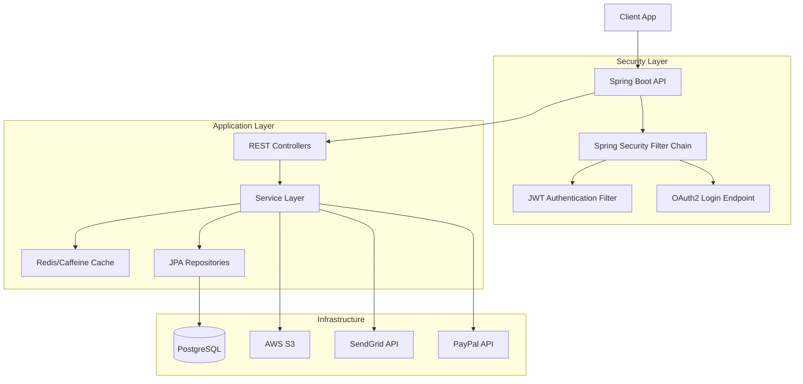

# 🛒 E-Commerce Backend API

[](https://www.oracle.com/java/)
[](https://spring.io/projects/spring-boot)
[](https://spring.io/projects/spring-security)
[](https://www.postgresql.org/)
[](https://junit.org/junit5/)
[](LICENSE)

Backend RESTful API cho hệ thống thương mại điện tử, được xây dựng với **Spring Boot 3**, kiến trúc phân tầng hiện đại, bảo mật cao và khả năng mở rộng.

## 🚀 Live Demo & Docs

| Service | URL |
| :--- | :--- |
| **API Base URL** | [https://e-commerce-shop-be-cvtf.onrender.com](https://e-commerce-shop-be-cvtf.onrender.com) |
| **Swagger UI** | `/swagger-ui.html` |
| **OpenAPI JSON** | `/v3/api-docs` |

---

## ✨ Technical Achievements

*   🏗️ **Clean Architecture:** Thiết kế phân tầng (Controller - Service - Repository) với **230+ classes**, tuân thủ SOLID và Design Patterns.
*   🔒 **Enterprise Security:** Bảo mật đa lớp với **Spring Security**, **JWT**, **OAuth2** (Google/Facebook), BCrypt và Method-level security.
*   ⚡ **High Performance:** Giảm **40%** tải database và đạt latency **<200ms** nhờ caching chiến lược với **Redis** và **Caffeine**.
*   🔄 **DevOps Ready:** Containerized với **Docker**, tích hợp CI/CD pipeline qua **Jenkins** cho zero-downtime deployment.
*   🧪 **Quality Assurance:** **75% code coverage** với bộ test tự động (**JUnit 5**, **Mockito**, **TestContainers**).
*   🔌 **Third-party Integration:** AWS S3 (storage), PayPal (payment), SendGrid (email).

---

## 🛠 Tech Stack

*   **Core:** Java 17, Spring Boot 3.2.5
*   **Security:** Spring Security, JWT, OAuth2 Client, BCrypt
*   **Database:** PostgreSQL, Spring Data JPA, Hibernate
*   **Caching:** Redis, Caffeine
*   **Mapping:** MapStruct
*   **Validation:** Hibernate Validator
*   **Documentation:** Springdoc OpenAPI 3.0
*   **Testing:** JUnit 5, Mockito, TestContainers, JaCoCo
*   **Build Tool:** Maven
*   **DevOps:** Docker, Jenkins, AWS S3

---

## 📦 Key Features

### 🔐 Authentication & Authorization
*   Register, Login, Logout
*   JWT Token based authentication
*   OAuth2 Login (Google, Facebook)
*   Forgot Password & Reset Password
*   Role-based Access Control (ADMIN, MANAGER, USER)
*   Method-level security annotations

### 🛍 Product Management
*   CRUD operations for products and categories
*   Advanced filtering, sorting, and pagination
*   Image upload to AWS S3
*   Product search by name, category, price range

### 🛒 Shopping Cart & Order
*   Add, update, remove cart items
*   Checkout process with inventory check
*   Order creation and status tracking
*   Order history for users

### 💳 Payment Integration
*   PayPal payment gateway integration
*   Transaction handling and callback
*   Payment status verification

### 📧 Notification
*   Email notifications via SendGrid
*   Order confirmation emails
*   Password reset emails

### 📊 Admin Dashboard APIs
*   Revenue statistics and charts data
*   User management
*   Order management (approve, ship, cancel)
*   Export reports (CSV, PDF, Excel)

---

## 🏗 Architecture Overview



---

## 🚀 Getting Started

### Prerequisites
*   JDK 17+
*   Maven 3.8+
*   Docker & Docker Compose (recommended)
*   PostgreSQL & Redis (or use Docker)

### Configuration

Create `application.properties` or `.env` file:

```properties
# Database
SPRING_DATASOURCE_URL=jdbc:postgresql://localhost:5432/ecommerce_db
SPRING_DATASOURCE_USERNAME=postgres
SPRING_DATASOURCE_PASSWORD=your_password

# Redis
SPRING_REDIS_HOST=localhost
SPRING_REDIS_PORT=6379

# JWT
JWT_SECRET=your_super_secret_key_at_least_32_chars
JWT_EXPIRATION=86400000

# AWS S3
AWS_S3_BUCKET=your_bucket_name
AWS_ACCESS_KEY_ID=your_access_key
AWS_SECRET_ACCESS_KEY=your_secret_key
AWS_REGION=us-east-1

# SendGrid
SENDGRID_API_KEY=your_sendgrid_api_key
SENDGRID_FROM_EMAIL=noreply@yourdomain.com

# PayPal
PAYPAL_CLIENT_ID=your_paypal_client_id
PAYPAL_CLIENT_SECRET=your_paypal_client_secret
PAYPAL_MODE=sandbox
```

### Run with Docker (Recommended)

```bash
# Build and run all services (API, DB, Redis)
docker-compose up --build

# Access API
# http://localhost:8080
# Swagger UI: http://localhost:8080/swagger-ui.html
```

### Run Locally without Docker

1.  **Start PostgreSQL and Redis** on your machine.
2.  **Update configuration** in `application.properties`.
3.  **Build and run:**
    ```bash
    mvn clean install
    mvn spring-boot:run
    ```

---

## 🧪 Testing

Run all tests:
```bash
mvn clean test
```

Generate code coverage report:
```bash
mvn clean test jacoco:report
```
Open `target/site/jacoco/index.html` in your browser to view the report.

---

## 📄 API Documentation

Interactive API documentation is available via Swagger UI:

*   **URL:** `http://localhost:8080/swagger-ui.html`
*   **Format:** OpenAPI 3.0 (Swagger)

You can explore all endpoints, request/response schemas, and test APIs directly from the UI.

---

## 📂 Project Structure

```
src/
├── main/
│   ├── java/com/ecommerce/
│   │   ├── config/          # Security, Swagger, Redis config
│   │   ├── controller/      # REST Controllers
│   │   ├── service/         # Business logic
│   │   ├── repository/      # JPA Repositories
│   │   ├── entity/          # JPA Entities
│   │   ├── dto/             # Data Transfer Objects
│   │   ├── mapper/          # MapStruct mappers
│   │   ├── security/        # JWT, UserDetails, Filters
│   │   ├── exception/       # Global Exception Handler
│   │   └── util/            # Utility classes
│   └── resources/
│       └── application.properties
└── test/
    └── java/com/ecommerce/  # Unit & Integration Tests
```

---

## 👤 Author

**Ngo Thanh Loc**
*Java Back End Developer*
📧 ngoloc2706@gmail.com
🔗 [GitHub](https://github.com/ngothanhloc2503)
🔗 [GitLab](https://gitlab.com/ntloc2503)
🔗 [LinkedIn](www.linkedin.com/in/thanh-loc-ngo-0749692b5)

---

## 📝 License

This project is licensed under the MIT License - see the [LICENSE](LICENSE) file for details.